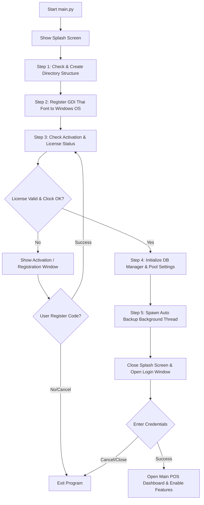
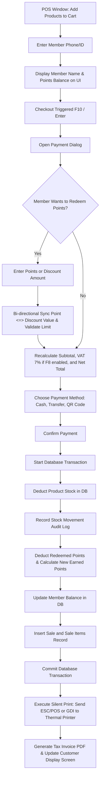
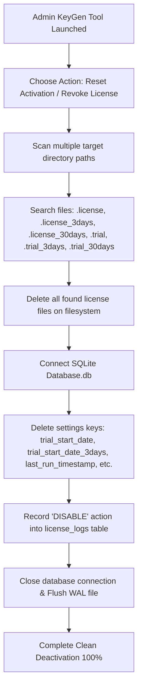

# เอกสารโครงสร้างระบบและภาพรวมการทำงาน (Store POS System Overview & Architecture)

ระบบจัดการจุดขาย (Point of Sale - POS) พัฒนาขึ้นด้วยภาษา Python และไลบรารี CustomTkinter สำหรับส่วนติดต่อผู้ใช้ (GUI) ออกแบบมาสำหรับการทำงานแบบออฟไลน์อย่างสมบูรณ์แบบ แข็งแกร่ง รองรับการสแกนบาร์โค้ด การพิมพ์สลิปและใบเสร็จความร้อน Silent Printing ระบบการคำนวณภาษีสะสมคะแนนสมาชิก ระบบจัดการสำรองข้อมูลเบื้องหลังอัตโนมัติ และระบบตรวจสอบสิทธิ์การใช้งานแบบผูกกับฮาร์ดแวร์ (HWID)

---

## 1. โครงสร้างโฟลเดอร์ของโปรเจกต์ (Project Directory Structure)

อ้างอิงจากการตรวจสอบไฟล์จริงในโปรเจกต์ มีการแบ่งสัดส่วนโฟลเดอร์และไฟล์อย่างถูกต้องดังนี้:

* **`/` (Root Directory):**
  * `main.py` - ไฟล์รันโปรแกรมหลัก (เวอร์ชันจำหน่ายจริง/เต็มรูปแบบ)
  * `main_trial.py` - ไฟล์รันโปรแกรมเวอร์ชันทดลองใช้งาน 15 วัน
  * `main_trial_3days.py` - ไฟล์รันโปรแกรมเวอร์ชันทดลองใช้งาน 3 วัน
  * `main_trial_30days.py` - ไฟล์รันโปรแกรมเวอร์ชันทดลองใช้งาน 30 วัน (1 เดือน)
  * `config.py` - ไฟล์ตั้งค่าระบบส่วนกลางทั้งหมด (เช่น อัตราภาษี ธีมสี ขนาดหน้าต่าง คีย์ลัดสิทธิ์ผู้ใช้ และตัวแปรระบบสมาชิก)
  * `performance_config.py` - คอนฟิกการทำงานระดับสูง (Low-End Mode) สำหรับลดภาระการใช้ทรัพยากรบนคอมพิวเตอร์สเปกเก่า
  * `keygen_standalone.py` - เครื่องมือสแตนด์อโลนสำหรับผู้พัฒนา/แอดมิน เพื่อ Generate License Key และล้างสิทธิ์เครื่อง (Reset Activation)
  * `requirements.txt` - รายการไลบรารีภายนอกที่โปรแกรมใช้งาน
  * `FC Sara Samkan [Non-commercial] Bold.ttf` - ไฟล์ฟอนต์หลักที่ใช้สำหรับพิมพ์ใบเสร็จภาษาไทย ลงทะเบียนกับ Windows GDI ผ่าน `main.py`
  * `icon.ico` - ไอคอนหลักของหน้าต่างโปรแกรม
  * `kill_storepos.bat` - สคริปต์แบทช์สำหรับปิดกระบวนการทำงานของ StorePOS ทั้งหมดในระบบ
  * `PROJECT_OVERVIEW.md` - เอกสารภาพรวมระบบ (ไฟล์นี้)
  * `README.md` - เอกสารแนะนำโปรเจกต์เบื้องต้น
  * `.gitignore` - ไฟล์กำหนดข้อยกเว้น Git
  * `template_สินค้า_20260721.xlsm` - แม่แบบนำเข้าสินค้าจาก Excel

* **`assets/` (Asset Directory):**
  * `app_border.png` - รูปภาพขอบหน้าต่างแอปพลิเคชัน
  * `ui/` - โฟลเดอร์ย่อยสำหรับ UI assets

* **`Backup/` (Text-Based Backup Directory):**
  * เก็บไฟล์บันทึกยอดขาย .txt (`Current_Sales_Log.txt`) และการส่งออกสินค้าเป็น Markdown

* **`Excel_Exports/` (Excel Export Directory):**
  * เก็บไฟล์ Excel ที่ export จากระบบรายงาน

* **`Logs/` (Log Directory):**
  * เก็บไฟล์ Log รายวัน (.log) และไฟล์ ZIP SystemLogs ที่ export เพื่อส่งเคลม

* **`data/` (Root Data Directory):**
  * `database.db` - ไฟล์ฐานข้อมูลหลักของ SQLite
  * `.license` - ไฟล์สำหรับเก็บ License Key (เต็มรูปแบบ) ในรูป Base64
  * `.trial` - ไฟล์สำหรับเก็บข้อมูลวันเริ่มทดลอง 15 วัน
  * `.trial_3days` - ไฟล์สำหรับเก็บข้อมูลวันเริ่มทดลอง 3 วัน
  * `.trial_30days` - ไฟล์สำหรับเก็บข้อมูลวันเริ่มทดลอง 30 วัน
  * `.license_3days` - ไฟล์ License สำหรับระบบทดลอง 3 วัน (สร้างเมื่อเปิดใช้งาน)
  * `.license_30days` - ไฟล์ License สำหรับระบบทดลอง 30 วัน (สร้างเมื่อเปิดใช้งาน)
  * `products/` - โฟลเดอร์เก็บไฟล์ภาพสินค้า (.png)
  * `products_img/` - โฟลเดอร์เก็บภาพสินค้าเพิ่มเติม
  * `backups/` - โฟลเดอร์เก็บไฟล์สำรองข้อมูลอัตโนมัติ (.zip)
  * `receipts/` - โฟลเดอร์เก็บไฟล์ PDF ใบเสร็จรับเงิน
  * `delivery_notes/` - โฟลเดอร์เก็บไฟล์ PDF ใบส่งของ
  * `tax_invoices/` - โฟลเดอร์เก็บไฟล์ PDF ใบกำกับภาษีเต็มรูปแบบ
  * `temp/` - โฟลเดอร์เก็บไฟล์ชั่วคราว
  * `live_backup.zip` - ไฟล์สำรองข้อมูลสด

* **`ui/` (GUI Layer - CustomTkinter Views):**
  * โฟลเดอร์ที่รวบรวมหน้าต่าง GUI ทุกส่วนของระบบ
  * `login_window.py` - หน้าจอเข้าสู่ระบบ แบ่งสิทธิ์ Cashier, Manager, Admin
  * `pos_window.py` - หน้าจอหลักสำหรับทำรายการขาย (POS) รองรับ Multi-Session, พักบิล, แลกคะแนนสมาชิก
  * `product_window.py` - หน้าจอจัดการสินค้า คลังสินค้า หมวดหมู่ แบรนด์ และ Product Wizard สำหรับเพิ่มสินค้า
  * `settings_window.py` - หน้าจอตั้งค่าข้อมูลร้านค้า เครื่องพิมพ์ และระบบสำรองข้อมูล
  * `activation_window.py` - หน้าจอลงทะเบียนเปิดใช้งาน (Activation) เมื่อยังไม่มีไลเซนส์หรือหมดอายุ
  * `customer_display.py` - หน้าจอรองสำหรับเชื่อมต่อมอนิเตอร์ตัวที่ 2 แสดงรายการฝั่งลูกค้า
  * `reports_window.py` - หน้าจอรายงานสถิติยอดขาย ยอดขายวันนี้/เดือนนี้ การแปลช่องทางการชำระเงินเป็นภาษาไทย
  * `history_window.py` - หน้าต่างประวัติการขาย พร้อมกรองตามวันที่และดูรายละเอาย่อย
  * `returns_window.py` - หน้าต่างจัดการคืนสินค้า
  * `stock_window.py` - หน้าต่างจัดการสต็อกและการเคลื่อนไหว
  * `users_window.py` - หน้าต่างจัดการผู้ใช้ระบบ
  * `vendor_window.py` - หน้าต่างจัดการผู้จัดจำหน่าย
  * `brand_window.py` - หน้าต่างจัดการแบรนด์สินค้า
  * `member_window.py` - หน้าต่างจัดการสมาชิกและระดับสมาชิก
  * `parked_window.py` - หน้าต่างจัดการบิลขายที่พักไว้ (Hold Bill)
  * `main_window.py` - หน้าต่างหลักหลังเข้าสู่ระบบ ประกอบด้วยเมนูต่างๆ และ Navigation
  * `splash_screen.py` - หน้าจอต้อนรับแสดงตอนบูตเครื่องพร้อมโหลดภารกิจพื้นหลัง (Multi-threaded)
  * `help_window.py` - หน้าคู่มือการใช้งานระบบที่มี 16 หัวข้อครอบคลุมการใช้งานทั้งหมด

* **`database/` (Data Access Layer):**
  * `db_manager.py` - คลาสจัดการฐานข้อมูล SQLite รองรับ Connection Pool, บังคับใช้ Foreign Keys, PRAGMAs ด้านความเร็ว, Auto-Initialization และ Schema Upgrade แบบปลอดภัย

* **`utils/` (Business Logic & Helper Utilities):**
  * `license_system.py` - ระบบตรวจสอบ HWID, บันทึกไลเซนส์, เช็คเวลาเครื่องป้องกันการโกงเวลา (Full License)
  * `license_system_trial.py` - ระบบจัดการ License ทดลองใช้งาน 15 วัน
  * `license_system_trial_3days.py` - ระบบจัดการ License ทดลองใช้งาน 3 วัน
  * `license_system_trial_30days.py` - ระบบจัดการ License ทดลองใช้งาน 30 วัน (ใช้ Registry สำหรับเก็บวันที่เริ่มเพื่อความปลอดภัย)
  * `backup_utils.py` - ระบบส่งออกสินค้าเป็น Markdown, ระบบปิดยอดขายประจำวัน, และ Background Thread สำรองข้อมูลอัตโนมัติ (ZIP + WAL Flush + Pruning)
  * `logger.py` - ระบบเก็บบันทึก Log รายวันแบบ 100% ครอบคลุม Unhandled Exceptions ทั่วทั้งแอปพลิเคชัน (Tkinter Hook, Thread Hook, sys.excepthook)
  * `pdf_utils.py` - ระบบสร้างเอกสาร PDF ใบเสร็จ
  * `tax_invoice.py` - ระบบสร้างใบกำกับภาษีเต็มรูปแบบในรูปแบบ PDF
  * `delivery_note.py` - ระบบสร้างใบส่งของ PDF
  * `printer_utils.py` - ระบบจัดการไดรเวอร์และการพิมพ์สลิปด่วนแบบเงียบ (Silent Printing) ด้วย ESC/POS หรือ GDI
  * `barcode_utils.py` - ระบบสร้างภาพบาร์โค้ดสินค้า (Code128/EAN13) และสุ่มรหัสสินค้า
  * `excel_utils.py` - ระบบจัดการการนำเข้า-ส่งออกสินค้าและสรุปยอดขายด้วย Excel
  * `input_utils.py` - ตัวจัดการการรับแป้นพิมพ์ภาษาอังกฤษ ป้องกันแป้นพิมพ์ภาษาไทยค้างเมื่อยิงสแกนเนอร์บาร์โค้ด
  * `image_utils.py` - ตัวปรับและจัดการคุณภาพรูปภาพสินค้าเพื่อประสิทธิภาพที่สูงขึ้น
  * `system_utils.py` - ยูทิลิตี้ระบบหลักสำหรับจัดการทรัพยากรและการเปิดแอปพลิเคชันใหม่
  * `shop_status.py` - ตัวจัดการและตรวจสอบสถานะ เปิด/ปิด ร้านค้าประจำวัน

* **`docs/` (System Documentation):**
  * `CHANGELOG.md` - บันทึกความเปลี่ยนแปลงของโปรแกรม
  * `CHANGELOG_NEW.md` - บันทึกความเปลี่ยนแปลงรูปแบบใหม่
  * `ORGANIZATION_REPORT.md` - รายงานโครงสร้างองค์กร
  * `POS_REFAC_REPORT.md` - รายงานการปรับปรุง POS
  * `SPLASH_SCREEN_AND_LOCK_FIX_REPORT.md` - รายงานการแก้ไข Splash Screen และ Database Lock

* **`tests/` (Test Suite):**
  * เก็บรวบรวมไฟล์สคริปต์ Unit Test และ Integration Test (มากกว่า 30 ไฟล์ เช่น `test_e2e_full_system.py`, `test_refactoring.py`, `verify_license_system.py`, `test_30day_trial_system.py` และอื่นๆ)

* **`tools/` (Admin & Build Tools):**
  * `deploy_to_stdeploy.py` - เครื่องมือในการ Deploy ซอฟต์แวร์
  * `keygen_standalone.py` - สแตนด์อโลนคีย์เจน สำหรับ Admin
  * `license_generator.py` - สคริปต์สำหรับ Generate License Key ของ Admin
  * `license_manager.py` - ตัวทดสอบและจัดการสิทธิ์ของนักพัฒนา

---

## 2. โมดูลสำคัญและสถาปัตยกรรมภายใน (Key Architectural Modules)

### 2.1 โครงสร้างฐานข้อมูล (Database Layer)
โปรแกรมใช้งาน **SQLite** ผ่านโมดูล [db_manager.py](file:///c:/Users/admin/Documents/store-pos/database/db_manager.py) ซึ่งมีการออกแบบด้านความปลอดภัยและประสิทธิภาพไว้สูงมาก:
1. **Connection Pool:** ออกแบบมาเพื่อลด overhead ในการสร้างการเชื่อมต่อบ่อยๆ ในโปรแกรมมัลติเธรด โดยจำกัด Pool size สูงสุดตามการตั้งค่าประสิทธิภาพ (ค่าเริ่มต้น 3, อ่านจาก `performance_config.DB_CONNECTION_POOL_SIZE`)
2. **SQLite Performance PRAGMAs:**
   * `journal_mode=WAL` (Write-Ahead Logging) เพื่อความรวดเร็วในการเขียนข้อมูลและลดปัญหาการล็อกฐานข้อมูล
   * `synchronous=NORMAL` เพื่อลดความถี่การซิงค์ข้อมูลลงดิสก์โดยตรง เพิ่มประสิทธิภาพขณะเขียนบิลขาย
   * `foreign_keys = ON` เพื่อบังคับใช้กฎความสัมพันธ์ระหว่างตารางอย่างเคร่งครัด
   * `cache_size=-8000` (ขนาด Cache 8MB) และใช้ `temp_store=MEMORY` สำหรับดึงข้อมูลตารางชั่วคราวอย่างรวดเร็ว
   * `busy_timeout = 15000` (15 วินาที) เพื่อป้องกัน Database Locked ในสภาพแวดล้อม multi-thread
   * `mmap_size=67108864` (64MB memory-mapped I/O) เพื่อเพิ่มความเร็วการอ่าน
3. **การออกแบบดัชนี (Indexes):** มีการทำ Composite Indexes บนฟิลด์ที่ใช้ค้นหาและคำนวณบ่อย เช่น `idx_products_active_stock` และ `idx_sales_date_status` เพื่อรองรับคลังสินค้าขนาดใหญ่ (1000+ รายการ)
4. **ตารางหลักในฐานข้อมูล:**
   * `users` - เก็บข้อมูลผู้ใช้งานระบบและแฮชรหัสผ่านด้วย `bcrypt`
   * `products`, `categories`, `brands`, `vendors` - จัดการแคตตาล็อกสินค้า
   * `members`, `member_tiers` - จัดการแต้มสะสมและระดับสมาชิก (VIP, Platinum, Gold, Silver, General)
   * `sales`, `sale_items` - บันทึกข้อมูลและประวัติการออกบิลขายหน้าร้าน
   * `returns`, `return_items` - บันทึกรายการคืนสินค้าแยกรายชิ้น
   * `stock_movements` - เก็บประวัติเคลื่อนไหวคลังสินค้า (Audit Trail Log) ตามสาเหตุ
   * `parked_sales` - จัดการฟีเจอร์พักบิล (Hold Bill) แยกอิสระตามเซสชันของผู้ใช้
   * `login_history` - ประวัติการเข้าใช้งานระบบ
   * `license_logs` - ประวัติการ Activate/Disable License
   * `settings` - เก็บข้อมูลตั้งค่าการเชื่อมต่อเครื่องพิมพ์ ภาษี อัตราส่วนแต้มสมาชิก และเวลาเปิดใช้งานล่าสุด

### 2.2 ระบบสิทธิ์และใบอนุญาตการใช้งาน (License & HWID System)
การตรวจสอบสิทธิ์ในไฟล์ [utils/license_system.py](file:///c:/Users/admin/Documents/store-pos/utils/license_system.py) ทำงานผูกกับคุณสมบัติของคอมพิวเตอร์อย่างมีเสถียรภาพ:
1. **การสร้าง HWID แบบทนทาน (Tolerant Matching):** คำนวณจากคีย์ของ Motherboard (Registry BIOS), CPU (Registry Processor), Disk C: Serial (Win32 API) และ Windows Machine GUID (Registry Cryptography) หากมีการลงวินโดวส์ใหม่หรือเปลี่ยนอุปกรณ์บางชิ้น ระบบจะยังอนุญาตให้เข้าโปรแกรมได้หากคะแนนความถูกต้องตรงกันตั้งแต่ 3 ใน 4 กลุ่ม
2. **ระบบการถอดรหัสและตรวจสอบลายเซ็น (Cryptographic Validation):**
   * ข้อมูลไลเซนส์ถูกเก็บแบบ Base64 เข้ารหัสในไฟล์ `data/.license`
   * การตรวจสอบลายเซ็นใช้ SHA-256 hash ผูกกับรหัส HWID เฉพาะตัวและ `SECRET_KEY` ของโปรแกรม (`POS_SYSTEM_2026_SECRET_KEY_DO_NOT_SHARE`) เพื่อป้องกันการคัดลอกไฟล์สิทธิ์ไปใช้งานบนเครื่องอื่น
3. **การนับอายุและการเตือน (Date-Based Expiry & Warnings):**
   * การคำนวณอายุการใช้งานเปรียบเทียบตามวันที่ในปฏิทิน (date-based) ไม่นับเป็นวินาที/ชั่วโมง ทำให้ผู้ใช้ใช้งานบิลได้จนถึงเวลา 23:59:59 น. ของวันสุดท้าย
   * มีระดับการแจ้งเตือน 4 ระดับ: `normal` (ปกติ), `warning` (เตือน), `critical` (เตือนวิกฤต), และ `expired` (ล็อกการทำงานเมื่อหมดอายุ)
   * เกณฑ์การเตือน: License ทดสอบ (1-7 วัน) เตือนเมื่อเหลือ ≤ 1 วัน, License ระยะสั้น (15-180 วัน) เตือนเมื่อเหลือ ≤ 3 วัน, License ระยะยาว (365+ วัน) เตือนเมื่อเหลือ ≤ 7 วัน
4. **ระบบตรวจจับการโกงเวลาเครื่อง (Clock Tamper Protection):**
   * ตรวจสอบเวลาปัจจุบันของระบบเทียบกับเวลาบันทึกการเปิดใช้ครั้งล่าสุดในตาราง `settings` (key: `last_run_timestamp`) หากเวลาปัจจุบันของเครื่องน้อยกว่าการบันทึกครั้งล่าสุด ระบบจะป้องกันและบล็อกการทำงานทันทีเพื่อป้องกันการย้อนเวลาขยายสิทธิ์การใช้งาน
5. **Multi-binding License:** รองรับการผูก License กับหลาย HWID พร้อมกันโดยคั่นด้วยจุลภาค (comma) สำหรับกรณีเปลี่ยนเครื่องบ่อย
6. **ระบบทดลองใช้ (Trial System):** มี 3 แบบ คือ 3 วัน, 15 วัน, และ 30 วัน แต่ละแบบใช้โมดูล `license_system_trial*.py` แยกกัน โดยเก็บวันเริ่มต้นทั้งในไฟล์ (`data/.trial`, `data/.trial_3days`, `data/.trial_30days`) และในฐานข้อมูล (settings) แบบ Base64 แบบสองชั้นเพื่อความปลอดภัย ส่วนรุ่น 30 วันใช้ Registry เพิ่มเติมในการตรวจจับการ Reset เครื่อง

### 2.3 ระบบสำรองข้อมูลอัตโนมัติเบื้องหลัง (Auto Background Backup System)
จัดอยู่ภายในไฟล์ [utils/backup_utils.py](file:///c:/Users/admin/Documents/store-pos/utils/backup_utils.py):
1. **Background Daemon Thread:** รันการทำงานแบบเบื้องหลังเมื่อโปรแกรมเริ่ม โดยไม่ขัดจังหวะการทำงานของ UI หลัก
2. **การทำ Checkpoint ก่อนสำรองข้อมูล:** สั่งการ `PRAGMA wal_checkpoint(TRUNCATE)` เคลียร์ไฟล์ WAL ลงไฟล์ `database.db` ให้ครบถ้วนก่อน เพื่อให้แน่ใจว่าไฟล์ที่ถูกบีบอัดเป็นเวอร์ชันล่าสุด 100%
3. **ZIP Compression:** บีบอัดฐานข้อมูล รูปภาพสินค้า (จาก `data/products/`) และเอกสาร PDF ใบเสร็จ (จาก `data/receipts/`) เป็นก้อนเดียวกันบันทึกไปที่ `data/backups/auto_backup_YYYYMMDD_HHMMSS.zip`
4. **ระบบ Pruning (ลบของเก่าส่วนเกิน):** ตรวจสอบจำนวนไฟล์ในโฟลเดอร์สำรองข้อมูลอัตโนมัติ หากมีจำนวนเกินกำหนด (ค่าเริ่มต้น 10 ไฟล์ หรือจาก `max_backups` ใน settings) จะลบไฟล์เก่าสุดทิ้งตามลำดับเพื่อป้องกันเนื้อที่ฮาร์ดดิสก์เต็ม

### 2.4 ระบบบันทึก Log ข้อผิดพลาด (Global Exception Hook Logging)
อยู่ในไฟล์ [utils/logger.py](file:///c:/Users/admin/Documents/store-pos/utils/logger.py) เพื่อประกันการดักจับจุดผิดพลาดได้ 100%:
1. **Tkinter GUI Event Hook:** ผูก `tk.Tk.report_callback_exception` เข้ากับล็อกเกอร์ เพื่อดักจับทุก Error ที่เกิดขึ้นขณะกดปุ่มหรือใช้งานหน้า GUI
2. **Thread Hook:** ผูก `threading.excepthook` เพื่อบันทึกบั๊กใน Thread ทำงานเบื้องหลัง
3. **Main Script Hook:** ผูก `sys.excepthook` เพื่อดักจับ exception ที่ไม่ถูก catch ทั่วทั้งโปรแกรม
4. **System Environment Header:** ในทุกเซสชันการเปิดใช้งาน โปรแกรมจะเขียนหัวประวัติแสดง Platform OS, Python Version, และพาธการติดตั้ง เพื่อให้ง่ายต่อการซ่อมบำรุง
5. **Export Logs Zip:** ฟังก์ชันบีบอัดประวัติ Log รายวัน (เก็บย้อนหลังสูงสุด 30 ไฟล์) เพื่อให้ลูกค้าคลิกดาวน์โหลดส่งเคลมได้ทันที

---

## 3. โฟลว์การทำงานหลักของระบบ (Core Operational Flows)

### 3.1 โฟลว์การเริ่มต้นระบบ (System Bootstrapping Flow)

เมื่อรันโปรแกรมหลัก ระบบจะทำขั้นตอนการบูตและตรวจสอบสิทธิ์ตามลำดับความปลอดภัยดังแผนภาพนี้:

---

### 3.2 โฟลว์การชำระเงินและการทำรายการขาย (POS Transaction & Checkout Flow)

เมื่อผู้ใช้ทำรายการขายหน้าร้าน ระบบจะซิงค์แต้ม สต็อก และเอกสารตามโฟลว์ด้านล่างนี้:

---

### 3.3 โฟลว์การถอนสิทธิ์และการใช้งานเครื่องมือผู้ขาย (License Revocation & Admin Tool Flow)

การล้างสิทธิ์หรือจัดการคีย์การขายผ่าน [keygen_standalone.py](file:///c:/Users/admin/Documents/store-pos/keygen_standalone.py) และระบบทดลองใช้ มีการรัดกุมในการลบไฟล์ในระบบดังนี้:

---

## 4. แผนการบำรุงรักษาและการพัฒนาต่อยอด (Future Maintenance Guidelines)

เพื่อให้ระบบมีความปลอดภัยและมีประสิทธิภาพในการทำงานสูงเสมอ ผู้พัฒนาควรรักษากฎเกณฑ์โครงสร้างเดิมดังนี้:

1. **การปรับเปลี่ยน Schema ฐานข้อมูล:**
   * ห้ามดัดแปลง schema ดั้งเดิมโดยไม่มีการรองรับความเข้ากันได้ย้อนหลัง (Backward Compatibility)
   * หากจำเป็นต้องเพิ่มฟิลด์หรือตารางใหม่ ให้เขียนเพิ่มเข้าไปในฟังก์ชัน `_upgrade_database_schema()` ใน [db_manager.py](file:///c:/Users/admin/Documents/store-pos/database/db_manager.py) พร้อมรันคำสั่ง `ALTER TABLE` หรือ `CREATE TABLE IF NOT EXISTS` เสมอ เพื่อให้การอัปเดตระบบของลูกค้ารายเดิมทำงานได้โดยข้อมูลไม่สูญหาย
   * ใช้ `BEGIN IMMEDIATE` ร่วมกับ `try...except...rollback` เพื่อป้องกันข้อมูลเสียหายจาก Schema Migration ที่ค้างกลางทาง
2. **การทำงานร่วมกับฟอนต์ไทยบน Windows:**
   * ตัวเลือกการพิมพ์ทั้งหมดใช้ตัวอักษรไทยในการพิมพ์สลิปและบิล การทดสอบเครื่องพิมพ์ความร้อน (Thermal Printer) ต้องเช็คการลงทะเบียน GDI Font (`FC Sara Samkan`) ผ่าน `ctypes.windll.gdi32.AddFontResourceW()` เสมอ
3. **การรักษาความปลอดภัยของไฟล์ License:**
   * ตัวทดลองใช้ 3 วัน, 15 วัน และ 30 วัน รวมไปถึงตัวไลเซนส์ถาวร มีการฝังไฟล์สิทธิ์กระจายในหลายพูลพาธเพื่อป้องกันการลบทิ้งแล้วกดลงซ้ำเพื่อวนลูปการใช้งาน
   * เครื่องมือในการดีบั๊กหรือรีเซ็ตระบบต้องรันผ่าน `keygen_standalone.py` โดยรักษารูปรหัส `SECRET_KEY` (`POS_SYSTEM_2026_SECRET_KEY_DO_NOT_SHARE`) ตัวแปรเดียวกันเพื่อการถอดรหัสแบบกลับตัวได้
4. **การจัดการทรัพยากรสำหรับคอมพิวเตอร์รุ่นเก่า:**
   * ใช้ Connection Pool ที่จำกัดขนาด (`_pool_size = 3` หรือปรับได้จาก `performance_config.py`)
   * เปิดใช้ Lazy Loading สำหรับภาพสินค้า และ Pagination สำหรับรายการสินค้ายาว
   * Garbage Collection ทำงานทุก 5 นาทีในพื้นหลัง
   * รายการ cache ต่างๆ ถูกจำกัดขนาดเพื่อประหยัด RAM
